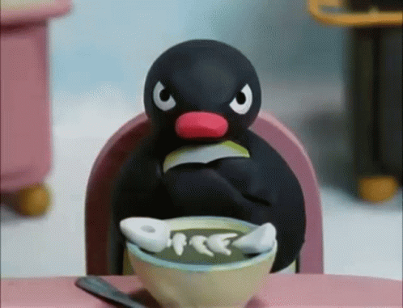

<html lang="en">
<head>
  <meta charset="utf-8" />
  <meta name="viewport" content="width=device-width,initial-scale=1" />
  <title>Security Simulation</title>
  
</head>
<body>

<!-- GIF banner -->

  
  

    <h1>GOTCHA!</h1>
    
This was a simulated phishing exercise.

    
Max is disappointed.

  

  <!-- Content explaining the simulation and next steps -->
  <main class="container">
    <h2>Phishing Simulation — What just happened</h2>
    

      This page is part of a company-run security training exercise. The link you clicked was intentionally simulated
      to help everyone learn how to spot and report phishing attempts.
    

    
<strong>Next steps:</strong>

    <ul>
      <li>If you entered any credentials on the original page, please change them immediately and notify IT.</li>
      <li>Report this click to the Security Team at <a href="mailto:security@yourcompany.example">security@yourcompany.example</a>.</li>
      <li>Review the short phishing-awareness guide we sent earlier (or visit the training portal).</li>
    </ul>

    <a class="btn" href="mailto:security@yourcompany.example">Report to Security</a>
  </main>

</body>
</html>
